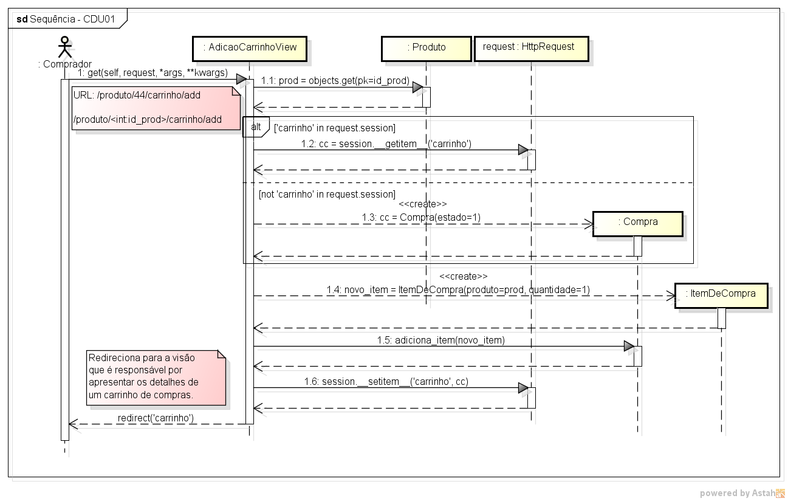
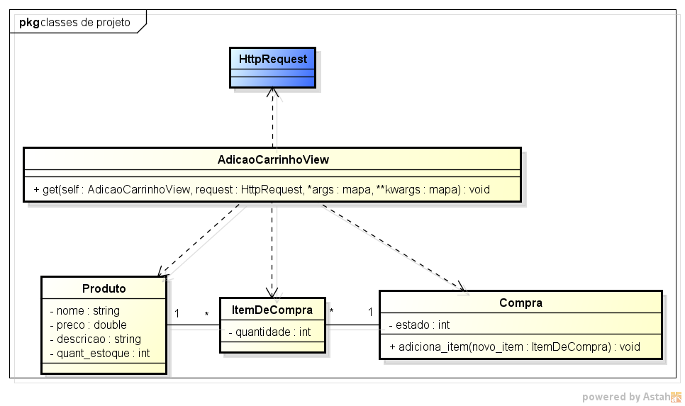

# CDU 01. Adicionar produto ao carrinho 

- **Ator principal**: Comprador.
- **Atores secundários**: não possui. 
- **Resumo**: Visualizando um dado produto, o comprador seleciona a opção "adicionar ao carrinho", associada ao produto específico. Como resultado o referido produto é adicionado ao conjunto daqueles que deseja comprar.
- **Pré-condição**: produto devidamente cadastrado e quantidade em estoque é maior que zero. Obs.: usuário não precisa estar logado para ter um carrinho de compras.
- **Pós-Condição**: Um item de compra relativo ao produto adicionado ao carrinho de compras.

## Fluxo Principal
| Ações do ator | Ações do sistema |
| :-----------: | :--------------: | 
| 0 - Estando visualizando um dado produto o comprador seleciona a opção "adicionar ao carrinho". | |  
| | 1 - o sistema adiciona o referido produto ao carrinho de compras associao à sessão ativa |
| | 2 - o sistema apresenta os detalhes do carrinho de compras e seus itens, permitindo que o comprador altere as quantidades dos mesmos |

## Fluxo Alternativo I - Identificador de produto inválido
| Ações do ator | Ações do sistema |
| :-----------: | :--------------: | 
| | 1.1 - o sistema exibe uma mensagem de "produto inválido" e oferece a possibilidade de retornar à listagem dos produtos |  
| (fluxo finalizado) | |

## Fluxo Alternativo II - Sem estoque de produto
| Ações do ator | Ações do sistema |
| :-----------: | :--------------: | 
| | 1.2 - o sistema exibe as informações do produto, informa a imporssibilidade de adicionar por falta de etoque |
| | 2.2 - o sistema oferece a opção para o comprador realizar a "reserva" do produto |
| (fluxo finalizado) | |  

## Fluxo Alternativo III - Produto já no carrinho
| Ações do ator | Ações do sistema |
| :-----------: | :--------------: | 
| | 1.2 - o sistema identifica que o produto já está no carrinho e incrementa a quantidade de 1 (um) |
| | (retorna ao passo 2 do fluxo principal) |

 
> Obs. as seções a seguir apenas serão utilizadas na segunda unidade do PDSWeb (segundo orientações do gerente do projeto).

## Diagrama de Interação (Sequência ou Comunicação)

## Diagrama de Classes de Projeto

