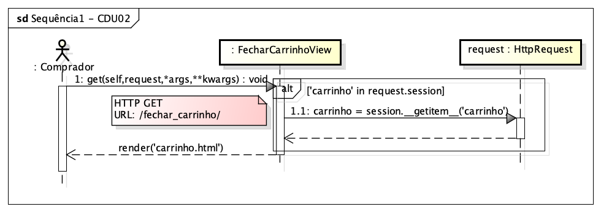
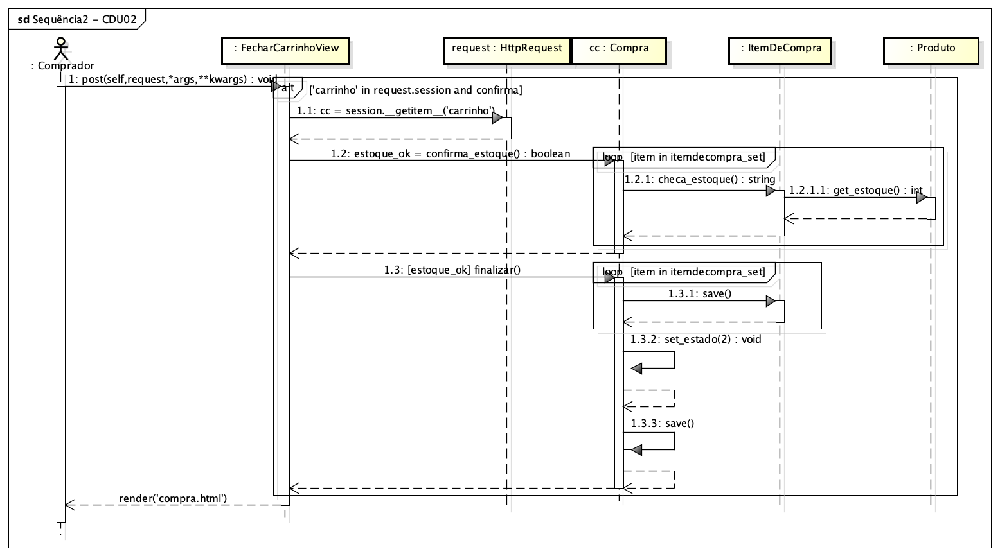
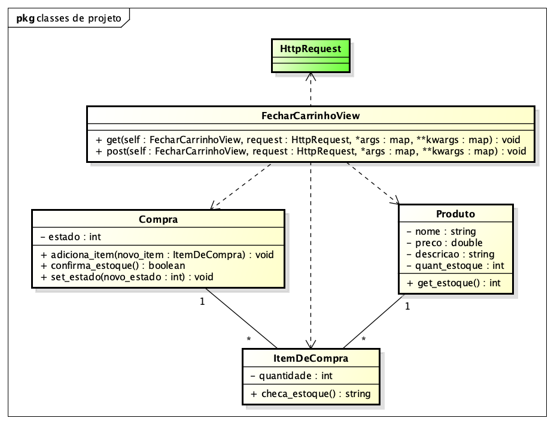

# CDU 02. Finalizar compra 

- **Ator principal**: Comprador
- **Atores secundários**: não possui 
- **Resumo**: Um comprador, após haver adicionado um conjunto de produtos no seu carrinho de comprs decide progredir e finalizar a sua compra. O sistema deve fornecer informações de pagamento, dado que a compra ficará pendente até a confirmação do pagamento.
- **Pré-condição**: Itens adicionados anteriormente no carrinho de compras do usuário.
- **Pós-Condição**: Carrinho de compras é trasformado em uma compra pendente, até que o pagamento correspondente seja reconhecido.

## Fluxo Principal
| Ações do ator | Ações do sistema |
| :-----------: | :--------------: | 
| 0 - na visualização dos detalhes do seu carrinho de compras o comprador seleciona a opção de "finalizar a compra" | |  
| | 1 - o sistema apresenta os detallhes do carrinho de compras e seus itens (valores unitários, quantidades, sub-totais) e total geral; informa também os dados para pagamento via PIX (chave e QR-Code). O sistema irá destacar que o pedido ficará pendente até que o pagamento correspondente seja identificado |
| 2 - o comprador confirma dos dados apresentados e confirma a compra | |
| | 3 - o sistema persiste todasa as informações associadas e apresenta os detalhes da compra, com a ênfase no estado da compra "aguardando confirmação de pagamento" | 

## Fluxo Alternativo I - Carrinho de compras vazio
| Ações do ator | Ações do sistema |
| :-----------: | :--------------: | 
| | 1.1 - o sistema retorna à tela principal do sistema, exibindo uma mensagem que o carrinho de compras está vazio |  
| (fluxo finalizado) | | 

## Fluxo Alternativo II - Cancelar a finalização da compra
| Ações do ator | Ações do sistema |
| :-----------: | :--------------: | 
| 2.2 - o comprador desiste da compra e seleciona a opção "cancelar" | |  
| | 3.2 - o sistema retorna à tela principal do sistema com a informação que a compra foi cancelada com sucesso (embora que os itens permanecerão no carrinho de compras) |
| (fluxo finalizado) | |

## Fluxo Alternativo III - Itens sem estoque
| Ações do ator | Ações do sistema |
| :-----------: | :--------------: | 
| | 1.3 - o sistema informa os (possíveis) itens sem estoque e questiona se o comprador deseja prosseguir a compra sem os itens para os quais não há estoque |
| 2.3 - o comprador responde que "sim", deseja seguir com a compra apenas dos itens com estoque | |
| | (retorna ao passo 1 do fluxo principal) |

## Fluxo Alternativo IV - Comprador altera a quanbtidade de algum item do carrinho
| Ações do ator | Ações do sistema |
| :-----------: | :--------------: | 
| 2.4 - o comprador altera a quantidade de algum item do carrinho (incrementa de um ou decrementa de um) | |
| (retorna ao passo 1 do fluxo principal, com o carrinho atualizado) | |

## Diagrama de Interação (Sequência ou Comunicação)
### 1ª etapa do Diagrama de Sequência

### 2ª etapa do Diagrama de Sequência

## Diagrama de Classes de Projeto

