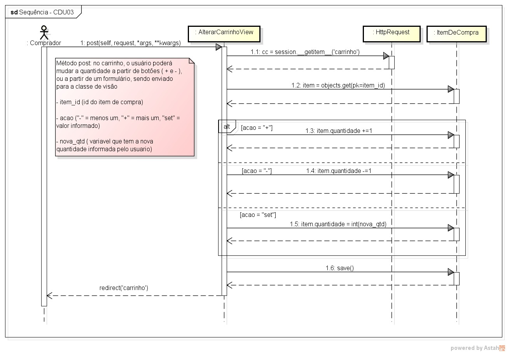

# CDU002. Alterar itens do carrinho

- **Ator principal**: Comprador
- **Atores secundários**: não possui
- **Resumo**: Estando no carrinho de compras, o comprador pode alterar a quantidade desejada de um determinado produto antes de finalizar uma compra. 
- **Pré-condição**: O carrinho deve ser criado e conter ao menos um produto.
- **Pós-Condição**: O carrinho é atualizado com as novas quantidades e valores.

## Fluxo Principal
| Ações do ator | Ações do sistema |
|:-------------:|:----------------:|
| 0 - O comprador solicita a alteração da quantidade de um item no carrinho. | |
| | 1 - O sistema identifica o item selecionado no carrinho. |
| | 2 - O sistema ajusta a quantidade do item conforme a ação do comprador. |
| | 3 - O sistema registra a alteração. |
| | 4 - O sistema atualiza a exibição do carrinho ao comprador. |

---

## Fluxo Alternativo I - Tentativa de reduzir para quantidade abaixo de 1
| Ações do ator | Ações do sistema |
|:-------------:|:----------------:|
| 1.1 - O comprador clica no botão `-` quando o item está com quantidade igual a 1. | |
| | 1.2 - O sistema mantém a quantidade igual a 1 (não permite valores menores). |
| | (Retorna ao passo 6 do fluxo principal) |

---

## Fluxo Alternativo II - Valor manual inválido
| Ações do ator | Ações do sistema |
|:-------------:|:----------------:|
| 2.1 - O comprador digita um valor não numérico ou menor que 1 no campo de quantidade. | |
| | 2.2 - O sistema desconsidera o valor informado e mantém a quantidade anterior. |
| | (Retorna ao passo 6 do fluxo principal) |

---

## Diagrama de Interação (Sequência ou Comunicação)

## Diagrama de Classes de Projeto

