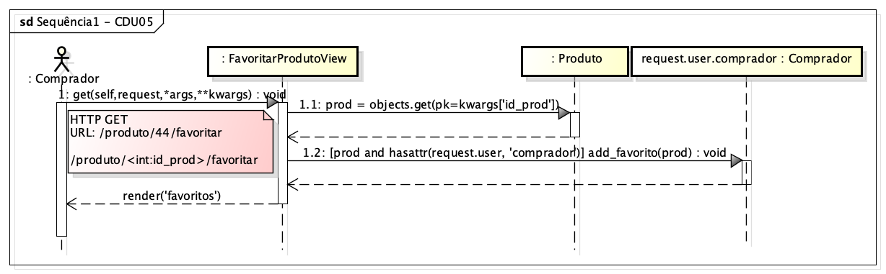
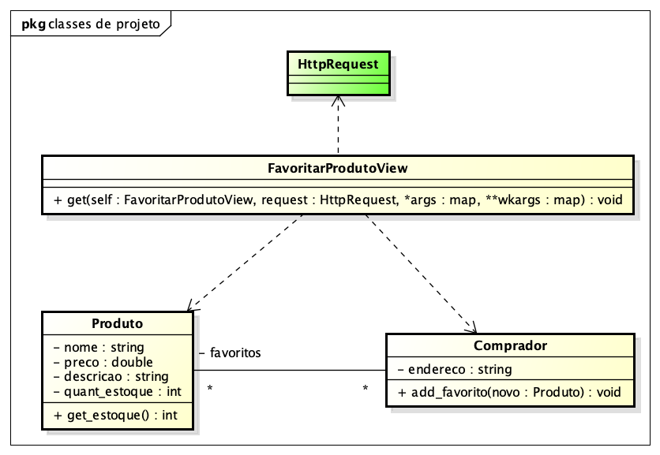

# CDU 05. Favoritar produto 

- **Ator principal**: Comprador.
- **Atores secundários**: não possui.	 
- **Resumo**: O comprador sinaliza um dos produtos oferecidos na lojinha como um dos seus favoritos. Sendo o mesmo listado, a partir desse momento, em uma lista diferenciada e sendo localizado mais facilmente. 
- **Pré-condição**: Produto devidamente cadastrado e comprador devidamente autenticado.
- **Pós-Condição**: Produto associado à lista de produtos favoritos do comprador em questão.

## Fluxo Principal
| Ações do ator | Ações do sistema |
| :-----------: | :--------------: | 
| 0 - na visualização dos detalhes de um dado produto, o comprador seleciona a opção de favoritar produto | |  
| | 1 - o sistema apresenta novamente o detalhamento do produto, com uma mensagem de adição com sucesso aos favoritos | 

## Fluxo Alternativo I - Produto não identificado
| Ações do ator | Ações do sistema |
| :-----------: | :--------------: |  
| | 1.1 - o sistema retorna à tela inicial, exibindo um mensagem de produto não identificado |
| (fluxo finalizado) | |

## Fluxo Alternativo II - Produto já adicionado aos favoritos
| Ações do ator | Ações do sistema |
| :-----------: | :--------------: | 
| | 1.2 - o sistema retorna à tela de detalhamento do produto, com uma mensagem de produto já adicionado aos favoritos |
| (fluxo finalizado) | |  

## Diagrama de Interação (Sequência ou Comunicação)

## Diagrama de Classes de Projeto

