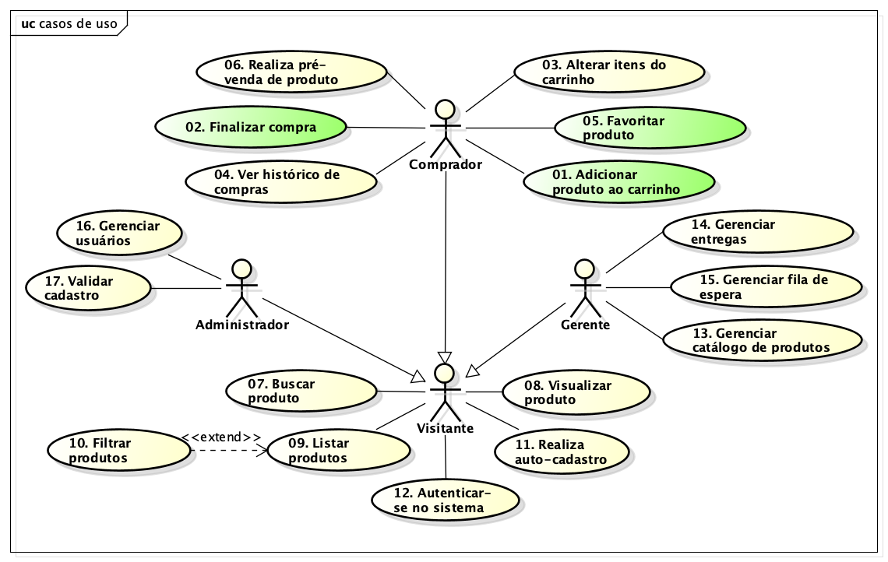
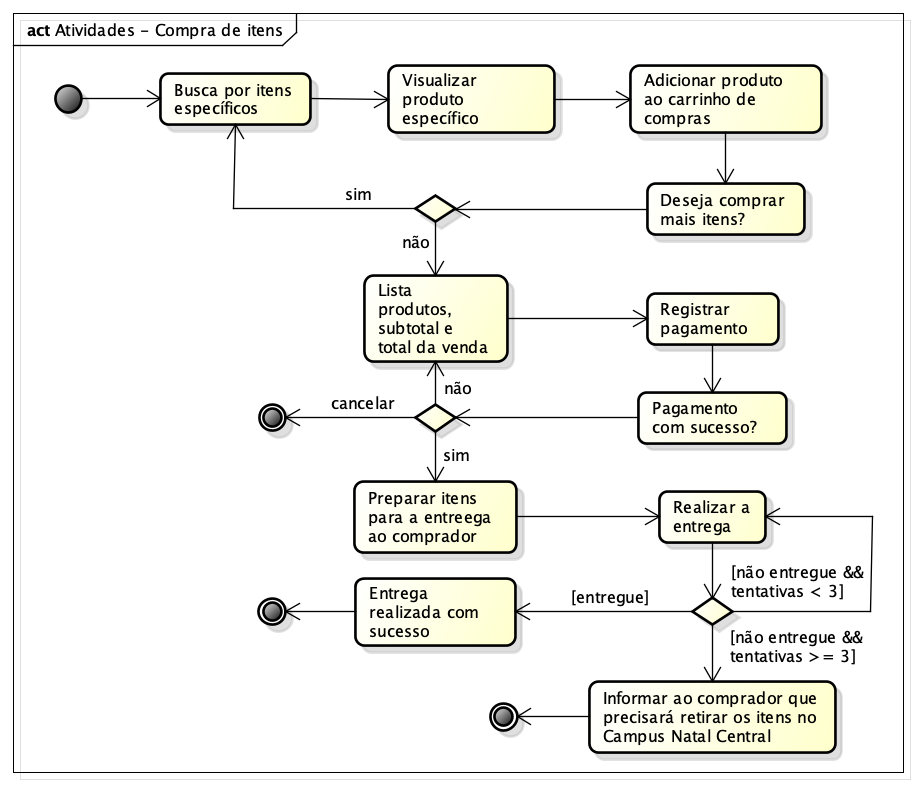

# Modelo de Casos de Uso

## 1. Diagrama de Casos de Uso

## 2. Listagem dos detalhamentos dos casos de uso

1. [CDU-01 - Adicionar produto ao carrinho](./cdu-01/detalhamento-01.md) :white_check_mark:
1. [CDU-02 - Finalizar compra](./cdu-02/detalhamento-02.md) :white_check_mark:
1. [CDU-03 - Alterar itens do carrinho](./cdu-03/detalhamento-03.md)
1. [CDU-04 - Ver histórico de compras](./cdu-04/detalhamento-04.md)
1. [CDU-05 - Faviritar produto](./cdu-05/detalhamento-05.md) :white_check_mark:
1. [CDU-06 - Realizar pré-venda de produto](./cdu-06/detalhamento-06.md)
1. [CDU-07 - Buscar produto](./cdu-07/detalhamento-07.md)
1. [CDU-08 - Visualizar produto](./cdu-08/detalhamento-08.md)
1. [CDU-09 - Listar produtos](./cdu-09/detalhamento-09.md)
1. [CDU-10 - Filtrar produtos](./cdu-10/detalhamento-10.md)
1. [CDU-11 - Ralizaer auto-cadastro](./cdu-11/detalhamento-11.md)
1. [CDU-12 - Autenticar-se no sistema](./cdu-12/detalhamento-12.md)
1. [CDU-13 - Gerenciar catálogo de produtos](./cdu-13/detalhamento-13.md)
1. [CDU-14 - Gerenciar entregas](./cdu-14/detalhamento-14.md)
1. [CDU-15 - Gerenciar fila de espera](./cdu-15/detalhamento-15.md)
1. [CDU-16 - Gerenciar usuários](./cdu-16/detalhamento-16.md)
1. [CDU-17 - Validar cadastro](./cdu-17/detalhamento-17.md)

## 3. Fluxo de Atividades para o processo de Compra de Itens

