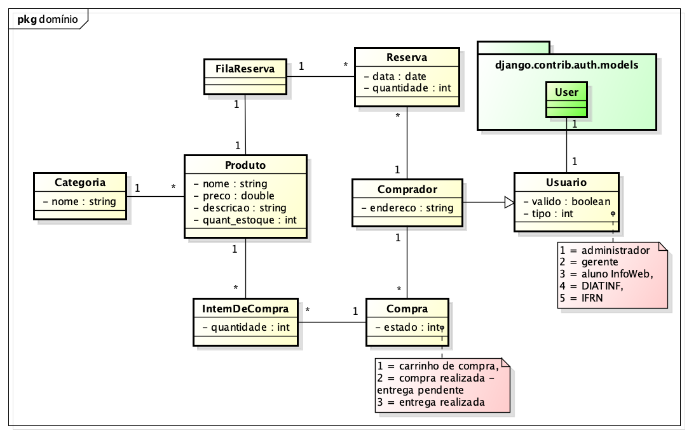

# Modelo de Domínio

## Glossário (sugestão)

Termo | Explicação
----- | ----------
Produto | Armazena das informações dos produtos disponíveis para venda
Categoria | Possibilita classificar os produtos pelos tipos específicos, tais como: camisas, bonés, botons, adesivos, etc.
Reserva | Representa a reserva de um produto específico por um usuário
FilaReserva | Responsável por gerenciar o conjunto das reservas de um dado produto
Compra | Inicialmente representa um carrinho de compras que pode ser transformado no registro de uma compra
ItemDeCompra | Representa um item específico de uma compra, definindo uma quantidade
